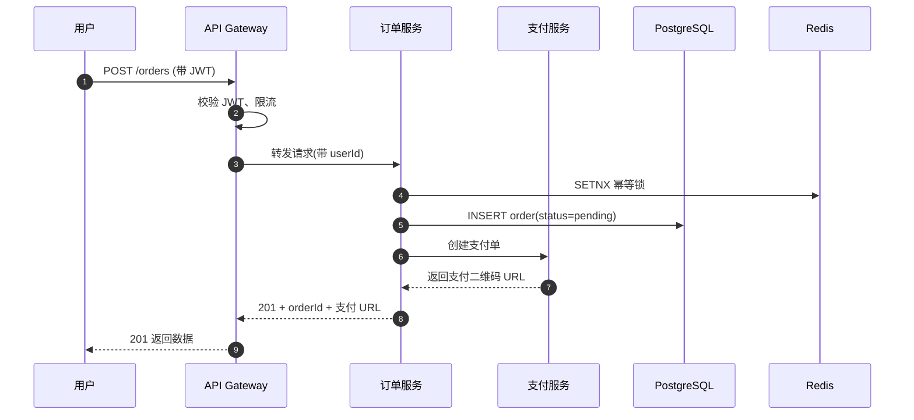

# 典型微服务电商架构

> 一个中等规模电商系统的服务拆分、层次划分和数据流向。帮助理解"为什么要拆成这几个服务、它们之间是怎么通信的"。

## 起点问题

看微服务架构图时最容易犯的错是——**把它当成组件清单**。其实架构图要回答的是三个问题:
1. **每一层负责什么**(客户端 / 网关 / 业务服务 / 数据)
2. **跨层调用怎么发生**(谁调谁、带什么参数)
3. **数据存在哪里、谁能写**(写权责、一致性边界)

## 整体视图

<svg viewBox="0 0 700 420" xmlns="http://www.w3.org/2000/svg"
     style="width:100%;max-width:700px;height:auto;font-family:system-ui,sans-serif">

  <defs>
    <marker id="arr" viewBox="0 0 10 10" refX="9" refY="5"
            markerWidth="6" markerHeight="6" orient="auto-start-reverse">
      <path d="M 0 0 L 10 5 L 0 10 z" fill="#9CA3AF"/>
    </marker>
  </defs>

  <!-- 分层标签 -->
  <text x="20" y="40"  font-size="11" fill="#9CA3AF">客户端层</text>
  <text x="20" y="170" font-size="11" fill="#9CA3AF">接入层</text>
  <text x="20" y="270" font-size="11" fill="#9CA3AF">业务服务层</text>
  <text x="20" y="370" font-size="11" fill="#9CA3AF">数据层</text>

  <!-- 客户端 -->
  <g transform="translate(140, 20)">
    <rect width="140" height="60" rx="10" fill="#E8F0FE" stroke="#4A7DC4"/>
    <text x="70" y="30" text-anchor="middle" font-size="13" font-weight="600" fill="#1F2937">Web 前端</text>
    <text x="70" y="48" text-anchor="middle" font-size="11" fill="#6B7280">React SPA</text>
  </g>

  <g transform="translate(420, 20)">
    <rect width="140" height="60" rx="10" fill="#E8F0FE" stroke="#4A7DC4"/>
    <text x="70" y="30" text-anchor="middle" font-size="13" font-weight="600" fill="#1F2937">移动端</text>
    <text x="70" y="48" text-anchor="middle" font-size="11" fill="#6B7280">iOS / Android</text>
  </g>

  <!-- API Gateway -->
  <g transform="translate(280, 140)">
    <rect width="140" height="60" rx="10" fill="#EEE8F5" stroke="#7A6BA8"/>
    <text x="70" y="30" text-anchor="middle" font-size="13" font-weight="600" fill="#1F2937">API Gateway</text>
    <text x="70" y="48" text-anchor="middle" font-size="11" fill="#6B7280">鉴权 · 路由 · 限流</text>
  </g>

  <!-- 服务 -->
  <g transform="translate(60, 240)">
    <rect width="140" height="56" rx="10" fill="#E6F4E6" stroke="#5B8F5B"/>
    <text x="70" y="28" text-anchor="middle" font-size="13" fill="#1F2937" font-weight="600">用户服务</text>
    <text x="70" y="46" text-anchor="middle" font-size="10" fill="#6B7280">注册 / 资料 / 权限</text>
  </g>
  <g transform="translate(280, 240)">
    <rect width="140" height="56" rx="10" fill="#E6F4E6" stroke="#5B8F5B"/>
    <text x="70" y="28" text-anchor="middle" font-size="13" fill="#1F2937" font-weight="600">订单服务</text>
    <text x="70" y="46" text-anchor="middle" font-size="10" fill="#6B7280">下单 / 查询 / 取消</text>
  </g>
  <g transform="translate(500, 240)">
    <rect width="140" height="56" rx="10" fill="#E6F4E6" stroke="#5B8F5B"/>
    <text x="70" y="28" text-anchor="middle" font-size="13" fill="#1F2937" font-weight="600">支付服务</text>
    <text x="70" y="46" text-anchor="middle" font-size="10" fill="#6B7280">下单 / 回调 / 对账</text>
  </g>

  <!-- 数据 -->
  <g transform="translate(140, 340)">
    <rect width="140" height="50" rx="10" fill="#FCE8CC" stroke="#D89547"/>
    <text x="70" y="30" text-anchor="middle" font-size="13" fill="#1F2937" font-weight="600">PostgreSQL</text>
  </g>
  <g transform="translate(420, 340)">
    <rect width="140" height="50" rx="10" fill="#FCE8CC" stroke="#D89547"/>
    <text x="70" y="30" text-anchor="middle" font-size="13" fill="#1F2937" font-weight="600">Redis</text>
  </g>

  <!-- 连线 -->
  <line x1="210" y1="80"  x2="320" y2="140" stroke="#9CA3AF" stroke-width="1.5" marker-end="url(#arr)"/>
  <line x1="490" y1="80"  x2="380" y2="140" stroke="#9CA3AF" stroke-width="1.5" marker-end="url(#arr)"/>
  <line x1="330" y1="200" x2="130" y2="240" stroke="#9CA3AF" stroke-width="1.5" marker-end="url(#arr)"/>
  <line x1="350" y1="200" x2="350" y2="240" stroke="#9CA3AF" stroke-width="1.5" marker-end="url(#arr)"/>
  <line x1="370" y1="200" x2="570" y2="240" stroke="#9CA3AF" stroke-width="1.5" marker-end="url(#arr)"/>
  <line x1="130" y1="296" x2="210" y2="340" stroke="#9CA3AF" stroke-width="1.5" marker-end="url(#arr)"/>
  <line x1="350" y1="296" x2="210" y2="340" stroke="#9CA3AF" stroke-width="1.5" marker-end="url(#arr)"/>
  <line x1="350" y1="296" x2="490" y2="340" stroke="#9CA3AF" stroke-width="1.5" marker-end="url(#arr)"/>
  <line x1="570" y1="296" x2="490" y2="340" stroke="#9CA3AF" stroke-width="1.5" marker-end="url(#arr)"/>

</svg>

## 分层职责

### 客户端层
不直连业务服务,所有请求都过 Gateway。好处是鉴权/限流/版本管理统一在一处做。

### 接入层(Gateway)
做三件事:
- **鉴权**:验证 JWT,提取用户身份塞到 header 里
- **路由**:根据 URL 前缀分发到后端服务(`/api/users/*` → 用户服务)
- **限流**:按 IP / 用户 / 接口做速率控制,防止被刷

### 业务服务层
每个服务**只管自己的领域**。订单服务不能直接写用户表,要取用户信息得调用户服务。这是微服务最容易违反的约束,但一旦打破就失去了"拆分"的意义。

### 数据层
- **PostgreSQL**:所有需要强一致性和事务的数据(订单、用户资料、支付记录)
- **Redis**:缓存(用户会话、热点商品)、分布式锁、计数器

## 一次下单请求的走向

以"用户点击下单"为例,完整路径:

## 关键要点

- **分层不是画图好看**,是划清责任边界 — 谁写什么表、谁调谁、出问题怎么定位
- **服务之间只用公开 API 通信**,绝不共享数据库连接/表
- **Gateway 是安全边界**,业务服务可以假设进来的请求已经鉴权过
- **Redis 的职责**要想清楚,别当万能缓存堆数据

## 进一步

- 加上消息队列(Kafka / RabbitMQ),画出异步场景
- 考虑服务注册发现(Consul / Nacos),看网关如何动态路由
- 看看真实项目里服务之间是怎么处理分布式事务的(TCC / Saga)
