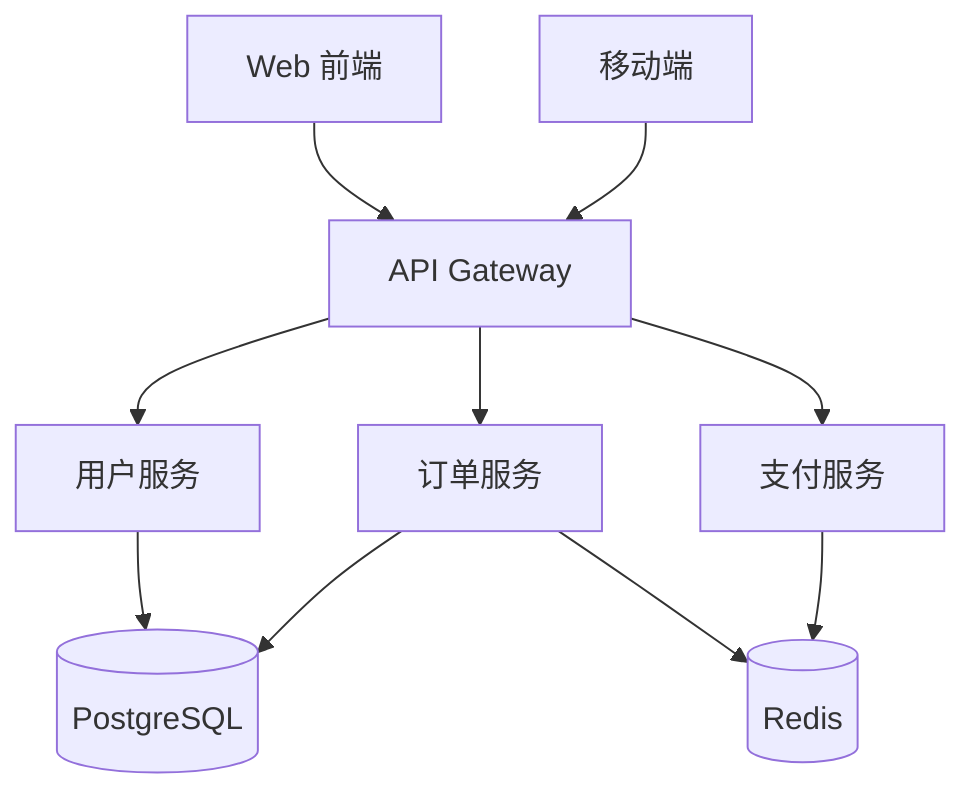
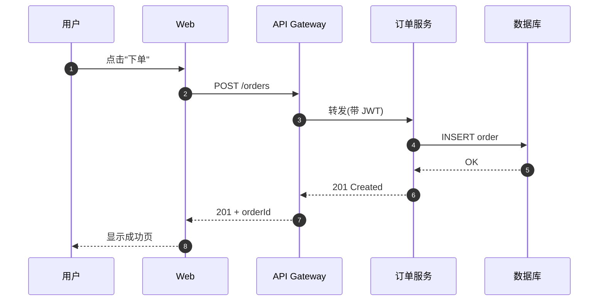
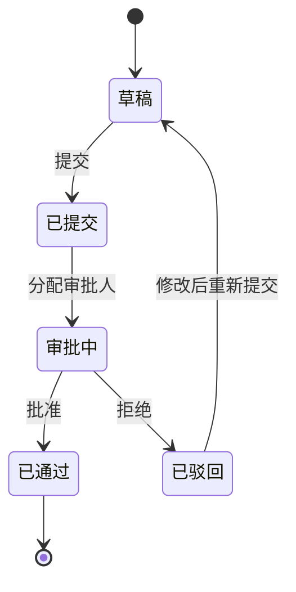

# Patterns — 常见视觉模式模板

> ⚠️ **重要前提**:这里列的 7 种模式是**参考词汇**,不是**唯一可选**。看到内容先去 `design-thinking.md` 里分析结构本质,再决定用这里的模板、还是改造/组合它们、还是原创一个形式。
>
> 真实内容的多样性远远超过 7 种模板。如果你每次都机械地套这里的某一个,那你就是做题家,不是得意门生。

遇到一类需求时,先看 `design-thinking.md` 理解内容的结构本质,然后:
1. 如果本质匹配这里某个模板 → 复制下来改内容
2. 如果本质接近但有差异 → 把模板当起点,改造结构
3. 如果本质完全不在这 7 种里 → 翻 `design-thinking.md` 的"设计模式库",参考那些没给 SVG 但列了思路的模式,自己搭

**目录:**
1. 学习路径(阶段卡片,顺序推进)
2. 流程图(步骤 + 判断分支)
3. 架构图(组件 + 连线)
4. 时序图(参与者 + 时间线)
5. 状态机(节点 + 转移)
6. 对比表(2-3 列并列)
7. 知识卡片网格(概念速查)

示例目录 `examples/` 里还有 5 种真实设计的参考:学习路径、架构图、交互探索、时间线、关系图(维恩+决策树)。看到它们是怎么"根据内容选形式"的。

---

## 1. 学习路径(阶段卡片)

**适用**:多阶段学习路线、项目 roadmap、按顺序推进的计划。**这是图片里那种效果**。

```xml
<svg viewBox="0 0 780 680" xmlns="http://www.w3.org/2000/svg"
     style="width:100%;max-width:780px;height:auto;font-family:system-ui,sans-serif">

  <!-- 阶段 1 -->
  <g transform="translate(20, 20)">
    <rect width="740" height="56" rx="12" fill="#E8F0FE" stroke="#4A7DC4" stroke-width="1"/>
    <rect x="16" y="14" width="72" height="28" rx="14" fill="#FFFFFF" opacity="0.75"/>
    <text x="52" y="33" text-anchor="middle" font-size="12" font-weight="600" fill="#4A7DC4">阶段 1</text>
    <text x="104" y="34" font-size="15" font-weight="600" fill="#1F2937">核心数据结构</text>
    <text x="722" y="34" text-anchor="end" font-size="12" fill="#6B7280">3-5 天 ▶</text>
  </g>

  <!-- 过渡注释 1→2 -->
  <g transform="translate(40, 92)">
    <line x1="12" y1="0" x2="12" y2="20" stroke="#D1D5DB" stroke-width="1.5"/>
    <text x="30" y="15" font-size="11" fill="#6B7280">↓ 数据会用了,解决"重启数据消失"问题</text>
  </g>

  <!-- 阶段 2 -->
  <g transform="translate(20, 130)">
    <rect width="740" height="56" rx="12" fill="#E6F4E6" stroke="#5B8F5B" stroke-width="1"/>
    <rect x="16" y="14" width="72" height="28" rx="14" fill="#FFFFFF" opacity="0.75"/>
    <text x="52" y="33" text-anchor="middle" font-size="12" font-weight="600" fill="#5B8F5B">阶段 2</text>
    <text x="104" y="34" font-size="15" font-weight="600" fill="#1F2937">持久化 — 解决掉电问题</text>
    <text x="722" y="34" text-anchor="end" font-size="12" fill="#6B7280">2-3 天 ▶</text>
  </g>

  <g transform="translate(40, 202)">
    <line x1="12" y1="0" x2="12" y2="20" stroke="#D1D5DB" stroke-width="1.5"/>
    <text x="30" y="15" font-size="11" fill="#6B7280">↓ 单机搞定了,解决"服务器挂掉"问题</text>
  </g>

  <!-- 阶段 3 -->
  <g transform="translate(20, 240)">
    <rect width="740" height="56" rx="12" fill="#EEE8F5" stroke="#7A6BA8" stroke-width="1"/>
    <rect x="16" y="14" width="72" height="28" rx="14" fill="#FFFFFF" opacity="0.75"/>
    <text x="52" y="33" text-anchor="middle" font-size="12" font-weight="600" fill="#7A6BA8">阶段 3</text>
    <text x="104" y="34" font-size="15" font-weight="600" fill="#1F2937">高可用 — 主从复制 + 哨兵</text>
    <text x="722" y="34" text-anchor="end" font-size="12" fill="#6B7280">3-5 天 ▶</text>
  </g>

  <g transform="translate(40, 312)">
    <line x1="12" y1="0" x2="12" y2="20" stroke="#D1D5DB" stroke-width="1.5"/>
    <text x="30" y="15" font-size="11" fill="#6B7280">↓ 高可用搞定,解决"单机撑不住高并发"问题</text>
  </g>

  <!-- 阶段 4 -->
  <g transform="translate(20, 350)">
    <rect width="740" height="56" rx="12" fill="#FCE8CC" stroke="#D89547" stroke-width="1"/>
    <rect x="16" y="14" width="72" height="28" rx="14" fill="#FFFFFF" opacity="0.75"/>
    <text x="52" y="33" text-anchor="middle" font-size="12" font-weight="600" fill="#D89547">阶段 4</text>
    <text x="104" y="34" font-size="15" font-weight="600" fill="#1F2937">高并发 — Cluster 集群 + 连接池</text>
    <text x="722" y="34" text-anchor="end" font-size="12" fill="#6B7280">4-6 天 ▶</text>
  </g>

  <g transform="translate(40, 422)">
    <line x1="12" y1="0" x2="12" y2="20" stroke="#D1D5DB" stroke-width="1.5"/>
    <text x="30" y="15" font-size="11" fill="#6B7280">↓ 架构完备,上生产前做好运维和监控</text>
  </g>

  <!-- 阶段 5 -->
  <g transform="translate(20, 460)">
    <rect width="740" height="56" rx="12" fill="#D8F0E6" stroke="#4AA688" stroke-width="1"/>
    <rect x="16" y="14" width="72" height="28" rx="14" fill="#FFFFFF" opacity="0.75"/>
    <text x="52" y="33" text-anchor="middle" font-size="12" font-weight="600" fill="#4AA688">阶段 5</text>
    <text x="104" y="34" font-size="15" font-weight="600" fill="#1F2937">生产运维 — 监控、安全、调优</text>
    <text x="722" y="34" text-anchor="end" font-size="12" fill="#6B7280">持续进行 ▶</text>
  </g>

  <!-- 底部总结卡 -->
  <g transform="translate(20, 550)">
    <rect width="740" height="110" rx="12" fill="transparent" stroke="#E5E7EB" stroke-width="1"/>
    <text x="20" y="28" font-size="13" font-weight="600" fill="#1F2937">三大核心问题对应关系</text>
    <text x="20" y="58" font-size="12" fill="#374151">⚡ 掉电数据丢失 → 阶段 2:AOF + RDB 持久化</text>
    <text x="20" y="80" font-size="12" fill="#374151">🖥 服务器宕机 → 阶段 3:主从 + Sentinel 自动切换</text>
    <text x="20" y="102" font-size="12" fill="#374151">🚀 高并发 → 阶段 4:Cluster 分片 + 连接池 + Pipeline</text>
  </g>

</svg>
```

**定制点**:改文字、加减阶段(每个阶段占 110px 高度:56 卡片 + 38 过渡 + 16 间隙)、调色(阶段色板循环)。

---

## 2. 流程图(步骤 + 判断)

**适用**:操作流程、决策树、数据处理管线。

```xml
<svg viewBox="0 0 600 480" xmlns="http://www.w3.org/2000/svg"
     style="width:100%;max-width:600px;height:auto;font-family:system-ui,sans-serif">

  <!-- 箭头 marker 定义 -->
  <defs>
    <marker id="arrow" viewBox="0 0 10 10" refX="9" refY="5"
            markerWidth="6" markerHeight="6" orient="auto-start-reverse">
      <path d="M 0 0 L 10 5 L 0 10 z" fill="#6B7280"/>
    </marker>
  </defs>

  <!-- 开始 -->
  <g transform="translate(230, 20)">
    <rect width="140" height="44" rx="22" fill="#E8F0FE" stroke="#4A7DC4"/>
    <text x="70" y="28" text-anchor="middle" font-size="13" fill="#1F2937" font-weight="600">开始</text>
  </g>

  <!-- 步骤 1 -->
  <g transform="translate(220, 100)">
    <rect width="160" height="50" rx="8" fill="#F9FAFB" stroke="#D1D5DB"/>
    <text x="80" y="31" text-anchor="middle" font-size="13" fill="#1F2937">读取输入</text>
  </g>

  <!-- 判断菱形 -->
  <g transform="translate(240, 180)">
    <polygon points="60,0 120,40 60,80 0,40" fill="#FEF3C7" stroke="#F59E0B"/>
    <text x="60" y="45" text-anchor="middle" font-size="12" fill="#1F2937">数据合法?</text>
  </g>

  <!-- 分支:是 -->
  <g transform="translate(220, 300)">
    <rect width="160" height="50" rx="8" fill="#D1FAE5" stroke="#10B981"/>
    <text x="80" y="31" text-anchor="middle" font-size="13" fill="#1F2937">处理并保存</text>
  </g>

  <!-- 分支:否 -->
  <g transform="translate(440, 200)">
    <rect width="140" height="50" rx="8" fill="#FEE2E2" stroke="#EF4444"/>
    <text x="70" y="31" text-anchor="middle" font-size="13" fill="#1F2937">抛出错误</text>
  </g>

  <!-- 结束 -->
  <g transform="translate(230, 400)">
    <rect width="140" height="44" rx="22" fill="#D8F0E6" stroke="#4AA688"/>
    <text x="70" y="28" text-anchor="middle" font-size="13" fill="#1F2937" font-weight="600">结束</text>
  </g>

  <!-- 连线 -->
  <line x1="300" y1="64"  x2="300" y2="100" stroke="#6B7280" stroke-width="1.5" marker-end="url(#arrow)"/>
  <line x1="300" y1="150" x2="300" y2="180" stroke="#6B7280" stroke-width="1.5" marker-end="url(#arrow)"/>
  <line x1="300" y1="260" x2="300" y2="300" stroke="#6B7280" stroke-width="1.5" marker-end="url(#arrow)"/>
  <text x="310" y="282" font-size="11" fill="#10B981">是</text>
  <line x1="360" y1="220" x2="440" y2="225" stroke="#6B7280" stroke-width="1.5" marker-end="url(#arrow)"/>
  <text x="380" y="215" font-size="11" fill="#EF4444">否</text>
  <line x1="300" y1="350" x2="300" y2="400" stroke="#6B7280" stroke-width="1.5" marker-end="url(#arrow)"/>

</svg>
```

---

## 3. 架构图(组件 + 连线)

**适用**:系统架构、服务拓扑、模块关系。

```xml
<svg viewBox="0 0 700 420" xmlns="http://www.w3.org/2000/svg"
     style="width:100%;max-width:700px;height:auto;font-family:system-ui,sans-serif">

  <defs>
    <marker id="arrow2" viewBox="0 0 10 10" refX="9" refY="5"
            markerWidth="6" markerHeight="6" orient="auto-start-reverse">
      <path d="M 0 0 L 10 5 L 0 10 z" fill="#9CA3AF"/>
    </marker>
  </defs>

  <!-- 分层标签 -->
  <text x="20" y="40"  font-size="11" fill="#9CA3AF">客户端层</text>
  <text x="20" y="170" font-size="11" fill="#9CA3AF">服务层</text>
  <text x="20" y="310" font-size="11" fill="#9CA3AF">数据层</text>

  <!-- 客户端 -->
  <g transform="translate(140, 20)">
    <rect width="140" height="60" rx="10" fill="#E8F0FE" stroke="#4A7DC4"/>
    <text x="70" y="30" text-anchor="middle" font-size="13" font-weight="600" fill="#1F2937">Web 前端</text>
    <text x="70" y="48" text-anchor="middle" font-size="11" fill="#6B7280">React SPA</text>
  </g>

  <g transform="translate(420, 20)">
    <rect width="140" height="60" rx="10" fill="#E8F0FE" stroke="#4A7DC4"/>
    <text x="70" y="30" text-anchor="middle" font-size="13" font-weight="600" fill="#1F2937">移动端</text>
    <text x="70" y="48" text-anchor="middle" font-size="11" fill="#6B7280">iOS / Android</text>
  </g>

  <!-- 网关 -->
  <g transform="translate(280, 140)">
    <rect width="140" height="60" rx="10" fill="#EEE8F5" stroke="#7A6BA8"/>
    <text x="70" y="30" text-anchor="middle" font-size="13" font-weight="600" fill="#1F2937">API Gateway</text>
    <text x="70" y="48" text-anchor="middle" font-size="11" fill="#6B7280">鉴权 · 路由 · 限流</text>
  </g>

  <!-- 服务 -->
  <g transform="translate(60, 240)">
    <rect width="140" height="56" rx="10" fill="#E6F4E6" stroke="#5B8F5B"/>
    <text x="70" y="32" text-anchor="middle" font-size="13" fill="#1F2937">用户服务</text>
  </g>
  <g transform="translate(280, 240)">
    <rect width="140" height="56" rx="10" fill="#E6F4E6" stroke="#5B8F5B"/>
    <text x="70" y="32" text-anchor="middle" font-size="13" fill="#1F2937">订单服务</text>
  </g>
  <g transform="translate(500, 240)">
    <rect width="140" height="56" rx="10" fill="#E6F4E6" stroke="#5B8F5B"/>
    <text x="70" y="32" text-anchor="middle" font-size="13" fill="#1F2937">支付服务</text>
  </g>

  <!-- 数据 -->
  <g transform="translate(140, 340)">
    <rect width="140" height="50" rx="10" fill="#FCE8CC" stroke="#D89547"/>
    <text x="70" y="30" text-anchor="middle" font-size="13" fill="#1F2937">PostgreSQL</text>
  </g>
  <g transform="translate(420, 340)">
    <rect width="140" height="50" rx="10" fill="#FCE8CC" stroke="#D89547"/>
    <text x="70" y="30" text-anchor="middle" font-size="13" fill="#1F2937">Redis</text>
  </g>

  <!-- 连线 -->
  <line x1="210" y1="80"  x2="320" y2="140" stroke="#9CA3AF" stroke-width="1.5" marker-end="url(#arrow2)"/>
  <line x1="490" y1="80"  x2="380" y2="140" stroke="#9CA3AF" stroke-width="1.5" marker-end="url(#arrow2)"/>
  <line x1="350" y1="200" x2="130" y2="240" stroke="#9CA3AF" stroke-width="1.5" marker-end="url(#arrow2)"/>
  <line x1="350" y1="200" x2="350" y2="240" stroke="#9CA3AF" stroke-width="1.5" marker-end="url(#arrow2)"/>
  <line x1="350" y1="200" x2="570" y2="240" stroke="#9CA3AF" stroke-width="1.5" marker-end="url(#arrow2)"/>
  <line x1="130" y1="296" x2="210" y2="340" stroke="#9CA3AF" stroke-width="1.5" marker-end="url(#arrow2)"/>
  <line x1="350" y1="296" x2="210" y2="340" stroke="#9CA3AF" stroke-width="1.5" marker-end="url(#arrow2)"/>
  <line x1="350" y1="296" x2="490" y2="340" stroke="#9CA3AF" stroke-width="1.5" marker-end="url(#arrow2)"/>
  <line x1="570" y1="296" x2="490" y2="340" stroke="#9CA3AF" stroke-width="1.5" marker-end="url(#arrow2)"/>

</svg>
```

**或者用 mermaid 更短**(适合结构复杂但样式要求不高的):

````markdown

````

---

## 4. 时序图(优先用 mermaid)

**适用**:API 调用序列、异步流程、多方协作。

````markdown

````

Obsidian 原生支持 mermaid,简单场景优先用它。

---

## 5. 状态机

用 mermaid 的 stateDiagram:

````markdown

````

需要更强样式控制时用 SVG,模板参考"流程图"章节。

---

## 6. 对比表(2-3 列并列)

**适用**:技术选型、方案对比、优劣分析。

```xml
<svg viewBox="0 0 760 320" xmlns="http://www.w3.org/2000/svg"
     style="width:100%;max-width:760px;height:auto;font-family:system-ui,sans-serif">

  <!-- 列 A -->
  <g transform="translate(20, 20)">
    <rect width="240" height="280" rx="12" fill="#E8F0FE" stroke="#4A7DC4"/>
    <text x="120" y="32" text-anchor="middle" font-size="15" font-weight="600" fill="#1F2937">方案 A:SQL</text>
    <text x="120" y="52" text-anchor="middle" font-size="11" fill="#4A7DC4">关系型数据库</text>
    <line x1="20" y1="68" x2="220" y2="68" stroke="#B8CFE8"/>
    <text x="20" y="92"  font-size="12" fill="#374151">✓ 强一致性保证</text>
    <text x="20" y="114" font-size="12" fill="#374151">✓ 复杂查询能力</text>
    <text x="20" y="136" font-size="12" fill="#374151">✓ 事务支持完整</text>
    <text x="20" y="170" font-size="12" fill="#9CA3AF">✗ 水平扩展难</text>
    <text x="20" y="192" font-size="12" fill="#9CA3AF">✗ schema 变更成本高</text>
  </g>

  <!-- 列 B -->
  <g transform="translate(280, 20)">
    <rect width="240" height="280" rx="12" fill="#E6F4E6" stroke="#5B8F5B"/>
    <text x="120" y="32" text-anchor="middle" font-size="15" font-weight="600" fill="#1F2937">方案 B:NoSQL</text>
    <text x="120" y="52" text-anchor="middle" font-size="11" fill="#5B8F5B">文档/键值数据库</text>
    <line x1="20" y1="68" x2="220" y2="68" stroke="#B8D8B8"/>
    <text x="20" y="92"  font-size="12" fill="#374151">✓ 水平扩展容易</text>
    <text x="20" y="114" font-size="12" fill="#374151">✓ schema 灵活</text>
    <text x="20" y="136" font-size="12" fill="#374151">✓ 写入吞吐高</text>
    <text x="20" y="170" font-size="12" fill="#9CA3AF">✗ 跨文档事务弱</text>
    <text x="20" y="192" font-size="12" fill="#9CA3AF">✗ JOIN 能力有限</text>
  </g>

  <!-- 列 C -->
  <g transform="translate(540, 20)">
    <rect width="200" height="280" rx="12" fill="#EEE8F5" stroke="#7A6BA8"/>
    <text x="100" y="32" text-anchor="middle" font-size="15" font-weight="600" fill="#1F2937">方案 C:混合</text>
    <text x="100" y="52" text-anchor="middle" font-size="11" fill="#7A6BA8">组合使用</text>
    <line x1="20" y1="68" x2="180" y2="68" stroke="#CFC4DC"/>
    <text x="20" y="92"  font-size="12" fill="#374151">✓ 扬长避短</text>
    <text x="20" y="114" font-size="12" fill="#374151">✓ 按场景分流</text>
    <text x="20" y="148" font-size="12" fill="#9CA3AF">✗ 架构复杂</text>
    <text x="20" y="170" font-size="12" fill="#9CA3AF">✗ 一致性维护成本</text>
  </g>

</svg>
```

**或用 markdown 表格**(更短):

```markdown
| 维度 | 方案 A | 方案 B | 方案 C |
|------|--------|--------|--------|
| 一致性 | ✓ 强 | △ 弱 | ✓ 按场景 |
| 扩展性 | ✗ 难 | ✓ 易 | ✓ |
| 复杂度 | 低 | 低 | 高 |
```

**选择标准**:对比内容短、维度明确 → markdown 表格;需要视觉层次/彩色区分 → SVG。

---

## 7. 知识卡片网格

**适用**:概念速查、术语卡、知识图谱一级索引。

```xml
<svg viewBox="0 0 780 320" xmlns="http://www.w3.org/2000/svg"
     style="width:100%;max-width:780px;height:auto;font-family:system-ui,sans-serif">

  <!-- 3x2 网格,每张卡 240x120,间距 20 -->
  <g transform="translate(20, 20)">
    <rect width="240" height="120" rx="12" fill="#E8F0FE" stroke="#4A7DC4"/>
    <text x="20" y="32" font-size="14" font-weight="600" fill="#1F2937">String</text>
    <text x="20" y="58" font-size="11" fill="#6B7280">最基本,值是字节数组</text>
    <text x="20" y="82" font-size="11" fill="#374151">场景:缓存、计数器、分布式锁</text>
  </g>

  <g transform="translate(280, 20)">
    <rect width="240" height="120" rx="12" fill="#E6F4E6" stroke="#5B8F5B"/>
    <text x="20" y="32" font-size="14" font-weight="600" fill="#1F2937">Hash</text>
    <text x="20" y="58" font-size="11" fill="#6B7280">键下的字段-值映射</text>
    <text x="20" y="82" font-size="11" fill="#374151">场景:对象存储、购物车</text>
  </g>

  <g transform="translate(540, 20)">
    <rect width="240" height="120" rx="12" fill="#EEE8F5" stroke="#7A6BA8"/>
    <text x="20" y="32" font-size="14" font-weight="600" fill="#1F2937">List</text>
    <text x="20" y="58" font-size="11" fill="#6B7280">双向链表</text>
    <text x="20" y="82" font-size="11" fill="#374151">场景:消息队列、最新动态</text>
  </g>

  <g transform="translate(20, 160)">
    <rect width="240" height="120" rx="12" fill="#FCE8CC" stroke="#D89547"/>
    <text x="20" y="32" font-size="14" font-weight="600" fill="#1F2937">Set</text>
    <text x="20" y="58" font-size="11" fill="#6B7280">无序集合,元素唯一</text>
    <text x="20" y="82" font-size="11" fill="#374151">场景:标签、好友关系、去重</text>
  </g>

  <g transform="translate(280, 160)">
    <rect width="240" height="120" rx="12" fill="#D8F0E6" stroke="#4AA688"/>
    <text x="20" y="32" font-size="14" font-weight="600" fill="#1F2937">ZSet</text>
    <text x="20" y="58" font-size="11" fill="#6B7280">有序集合,每元素带 score</text>
    <text x="20" y="82" font-size="11" fill="#374151">场景:排行榜、延时队列</text>
  </g>

  <g transform="translate(540, 160)">
    <rect width="240" height="120" rx="12" fill="#FDE2E2" stroke="#C86B6B"/>
    <text x="20" y="32" font-size="14" font-weight="600" fill="#1F2937">Stream</text>
    <text x="20" y="58" font-size="11" fill="#6B7280">5.0 新类型,类 Kafka 日志</text>
    <text x="20" y="82" font-size="11" fill="#374151">场景:消息流、事件溯源</text>
  </g>

</svg>
```

---

## 速查:该用哪个模式?

| 用户说的内容 | 用哪个模式 |
|--------------|-----------|
| 学这个要几步、怎么推进、学习路线 | 1. 学习路径 |
| 这个流程/操作怎么走 | 2. 流程图 |
| 这个系统/项目架构什么样 | 3. 架构图 |
| 这次请求/调用的顺序是什么 | 4. 时序图(mermaid) |
| 这个对象有哪些状态、怎么转移 | 5. 状态机(mermaid) |
| 方案 A 和 B 对比 | 6. 对比表 |
| 这个模块下有哪些概念 | 7. 知识卡片网格 |

不确定时,优先选**学习路径**或**知识卡片网格**——最万能,信息密度也合理。
